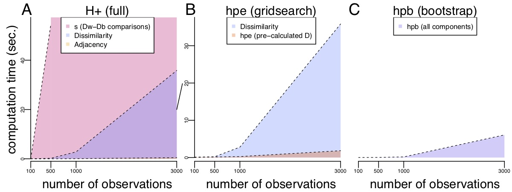

```{r, include = FALSE}
knitr::opts_chunk$set(
  collapse = TRUE,
  comment = "#>"
)
```


# Installation

At present, `fasthplus` is only available for installation via github using the `devtools` package.
A `CRAN` distribution is in preparation and this section will be updated to reflect its eventual availability.

```{r, eval=FALSE, echo=FALSE}
if(!requireNamespace('devtools')){
  install.packages('devtools')
}
```

```{r, eval=FALSE}
devtools::install_github(repo="ntdyjack/fasthplus", 
                         ref = "main", 
                         build_vignettes = TRUE, 
                         subdir = NULL)
```

Once the package is installed, the library can be loaded:

```{r}
library(fasthplus)
```

This vignette serves as an introductory example on how to utilize the `fasthplus` package.


# Background

A standard unsupervised analysis is to cluster (i.e. label or partition) observations into discrete groups using a dissimilarity measure, such as Euclidean distance. 
If there does not exist a ground-truth label for each observation, internal validity metrics, such as the tightness or consistency are often used, such as within-cluster sums of squares (WCSS) or Silhouette scores [@rousseeuw1987silhouettes] to evaluate the performance of a set of predicted cluster labels. 

Alternatively, one may also seek to assess the performance between multiple dissimilarity measures (i.e., geometric versus probabilistic dissimilarity) [@baker2021fast]. However, when comparing different dissimilarity measures, the interpretation of these performance metrics can be problematic as different dissimilarity measures have different magnitudes and ranges of values that they span leading to different ranges in the tightness of the clusters, thereby making the interpretation of these internal validity metrics difficult. 

One solution is to use **discordance as an internal validity metric**. For example, the discordance metric $G_{+}$ [@williams1971comparison; @rohlf1974methods] depends on the ranks of the dissimilarities, rather than on the dissimilarities themselves, thereby making it a 'scale-agnostic'. Next, we introduce more formally discordance followed the $G_{+}$ discordance metric along with our proposed discordance metric, $H_{+}$. 


## Discordance metrics 

Discordance can be described using two sets $A$ and $B$ by comparing their elements

$$ s=\sum_{a\in A}\sum_{b\in B}1_{[a>b]} $$

This notation can be can extended to the clustering problem for a given data set with $n$ observations. In the context of the clustering (or identifying predicted class labels), **discordance** can be conceptualized as measure that assess how well a given predicted class (or cluster) label fits the observed data.
A typical clustering algorithm utilizes a dissimilarity matrix $D(n\times n)$, with $N_{d}=\binom{n}{2}=n(n-1)/2$ unique pairs which would correspond to the upper diagonal entries of $D$.

$$
D=\begin{bmatrix}\begin{array}{cccc}
d_{11} & d_{12} & \cdots & d_{1n}\\
 & d_{22} & \cdots & d_{2n}\\
 &  & \ddots & \vdots\\
 &  &  & d_{nn}
\end{array}\end{bmatrix}
$$

When clustering $n$ observations, one can fix $D$ and place each of $n$ cells in one of $k$ clusters by optimizing some fitness criteria. Cluster fitness relates to how well a set of predicted cluster labels $L=[l_{1},\dots,l_{n}:l_{i}=1\dots,k]$ explain the observed data, for example, using the sum of within-cluster dissimilarities. In this case, for fixed $L$, we can generate an adjacency matrix that tells us whether each observation has the same label (i.e., falls in the same cluster)

$$
A=\begin{bmatrix}\begin{array}{cccc}
a_{11} & a_{12} & \cdots & a_{1n}\\
 & a_{22} & \cdots & a_{2n}\\
 &  & \ddots & \vdots\\
 &  &  & a_{nn}
\end{array}\end{bmatrix}\hspace{1em}a_{ij}=\begin{array}{cc}
1 & \mathrm{if}\enspace l_{i}=l_{j}\\
0 & \mathrm{otherwise}
\end{array}
$$

In terms of our notation, $s$ can be written as

$$
s=\sum_{i=2}^{n}\sum_{j<i}1_{[a_{ij}=1]}\sum_{k=2}^{n}\sum_{l<k}1_{[a_{kl}=0]}1_{[d_{ij}>d_{kl}]}
$$

### $G_{+}$ discordance metric

Previous work includes the $G_{+}$ discordance metric [@williams1971comparison; @rohlf1974methods] currently available in `R` in the `clusterCrit` package [@desgraupes2018package], where $s$ is scaled by $N_{d}(N_{d}-1)/2={N_{d} \choose 2}$, the total number of ways to compare each unique distance to every other.

$$
G_{+}=\frac{s}{N_{d}(N_{d}-1)/2}
$$

Generally, $G_{+}$ close to zero represents two concordant sets, while a larger $G_{+}$ is more discordant.

**Applications of $G_{+}$** The discordance metric $G_{+}$ can be used to quantify the cluster fitness for given a dissimilarity matrix $D$ and predicted cluster label $L$.
For example, if $D$ is fixed, lower values of $G_{+}$ among many sets of labels $L_{1}, L_{2} \dots$ indicate increased cluster fitness \citep{rand1971objective, williams1971comparison} or better performance.
If we instead fix $L$, we can also use $G_{+}$ to assess the fitness of multiple dissimilarity matrices $D_{1}, D_{2}\dots$ [@rohlf1974methods].

Because $G_{+}$ depends on the relative rankings of pairwise distances, this transformation enables a robust comparison of dissimilarity measures by the structure they impose on the data rather than by the exact values of the distances themselves.
This allows us to evaluate distances at highly varying scales without imposing bias with regard to the expected magnitude of distances.
In other words, discordance metrics such as $G_{+}$ offers a 'scale-agnostic' means to assess cluster fitness.

**Problems with $G_{+}$**

1. $G_{+}$ is slow to calculate for large data (due to the number of pairwise comparisons of dissimilarities in $s$). 
2. $G_{+}$ varies as a function of the proportion of observations in the predicted cluster labels (referred to as group or cluster balance), which is an undesirable property. For example, when simulating 'null' data (random Gaussian data with no mean difference between two groups) where we expect no differences between groups, the expected mean (and the interpretation) of the $G_{+}$ discordance metric in a 'null' analysis varies depending on the proportion of observations in each group. Specifically, as $\frac{N_{d}}{N_{d}-1} \to 1$, $G_{+}$ is a biased by a factor of $2\alpha(1-\alpha)$ where $\alpha$ is the proportion of $N_d$ distances that are within-cluster **(Figure 1)**.
 


```{r motivating-figure, echo=FALSE, fig.cap='[**Figure 1**: The $G_{+}$ discordance metric is biased as function of the proportion of within-cluster distances, which is a function of the group balance.]', out.width = '80%', fig.align='left'}
knitr::include_graphics("motivating_figure.jpeg")
```

In Figure 1 above, we randomly sampled $n$ = 1000 observations from a mixture distribution $b * X + (1-b) * Y$ with $b$ being the probability of an observation coming from $X \sim N(\mu_x, \sigma^2)$ and $1-b$ coming from $Y \sim N(\mu_y, \sigma^2)$ with **(Figure 1 A-B)** no mean difference ($\mu_x - \mu_y = 0$) (or a `null' setting), **(Figure 1 C-D)** a small mean difference ($\mu_x - \mu_y = 0.2$), and **(Figure 1 E-F)** a large mean difference ($\mu_x - \mu_y = 0.6$). We simulate data with **(Figure 1 A,C,E)** balanced groups ($b$ = 0.5) and **(Figure 1 B,D,F)** imbalanced groups ($b$ = 0.9). For each simulation, the top row contains observation colored by group ($X$ and $Y$) along the first two principal components (PCs) and the bottom row contains histograms of the within- ($D_{W}$) and between- ($D_{B}$) cluster distances (Euclidean) for the balanced and imbalanced groups. For each simulation, the bottom row includes $\alpha$ and the two discordance metrics $G_{+}$ and $H_{+}$. Generally, values close to zero represent more concordance, while a larger values represent more discordance.

### $H_{+}$ discordance metric

To ameliorate this effect, we propose $H_{+}$, which replaces the scaling factor  $N_{d}(N_{d}-1)/2$ in the denominator in $G_{+}$ with $\lvert D_{W}\rvert \lvert D_{B}\rvert = \alpha(1-\alpha)N_{d}^{2}$:

$$ 
H_{+}=\frac{s}{\lvert D_{W}\rvert \lvert D_{B}\rvert}
$$

where $\alpha \in (0,1)$ is the proportion of total distances $N_{d}$ that are within-cluster distances. In this way, $\lvert D_{W}\rvert=\alpha N_{d}$, and similarly, $\lvert D_{B}\rvert=(1-\alpha)N_{d}$. In other words, instead of scaling $s$ by the total number of ways to compare every distance to every other distance, we divide by the number of ways to compare within-cluster distances to between-cluster distances.


**Interpreting $H_{+}$ with two sets $A$ and $B$**. 

$H_{+}$ can be thought of as the product of two parameters $\gamma_{A},\gamma_{B}$, which lends itself to a simple interpretation for $H_{+}$: $\gamma_{A}\times100\%$ of $a \in A$ (or $d_{ij}\in D_{W}$) are strictly greater than $\gamma_{B}\times100\%$ of $b \in B$ (or $d_{kl}\in D_{B}$). We provide two equivalent algorithms for this estimation process, with the further benefit that our algorithms yields a range of reasonable values for $\gamma_{A},\gamma_{B}$. For further exploration of discordance, these estimators ($G_{+}$ and $H_{+}$), as well as their theoretical properties, please see Dyjack et al. (2022).

### Approximating $H_{+}$ 

One problem with the $H_{+}$ (and $G_{+}$) discordance metric is that it requires the calculation of both (i) the dissimilarity matrix $D(n\times n)$ and (ii) $s$. On a modest machine, calculating and storing $D$ becomes cumbersome at around 10000 observations with 1000 features. Furthermore, calculating $s$ is even less scalable.

```{r performance-plot, echo=FALSE, fig.cap='[**Figure 2**: Demonstration of computation time (in seconds) for several components of estimating H+]', out.width = '80%', fig.align='left'}

```

To address this, we propose two estimation procedures for $H_{+}$ that circumnavigate the most costly step: explicit calculation of $s$. However, the two functions differ in their treatment of the dissimilarity matrix $D$, yielding distinct computational and theoretical advantages for each. 

1. HPE ('h-plus estimator' or $H_{e}$) was inspired by the Top-Scoring Pair (TSP) [@leek2009tspair; @magis2012top] algorithms, which uses relative ranks to classify observations and $p$ quantiles of the data (rather than the $n$ observations themselves) where $p << n$, leading to significant improvements in the computational speed to calculate $H_{+}$. 

2. HPB ('h-plus bootstrap' or $H_{b}$) is an algorithm based on bootstrap sampling to avoid calculating the full dissimilarity matrix $D$, thereby leading to further improvements in computational speed to estimate $H_{+}$. 

These functions are implemented in the `hpe()` and `hpb()` functions in the `fasthplus` package, respectively.

The **primary difference** is that `hpe()` requires calculation of the full $D$ matrix as either an argument or an internal routine. 

- The more explicit `hpe()` gives a numerical bound for the accuracy as a function of $p$ and further benefits from facility to estimate $\gamma_{W}$ and $\gamma_{B}$. 
- The more efficient `hpb()` calculates sub-matrices of $D$ per iterate and convergence is primarily due to large sample-size behaviors. 

If calculation of $D$ is practical or fine control of numerical accuracy of the estimate is required, we recommend the utilization of the `hpe()` function. Otherwise, the scalability of `hpb()` makes it the more practical solution.


# Using `hpe()`

As input, `hpe()` can estimate $H_{+}$ using **either**:

1. Two arbitrary vectors: $A = \{a_1, \ldots \}$ and $B = \{b_1, \ldots \}$
2. A dissimilarity matrix $D$ of dimension $n \times n$ and set of labels $L$  of length $n$

The `hpe()` function returns a numeric value for $H_{+}$ given $A,B$ or $D,L$, or it returns a list with the additional parameters (`alpha` and `gammas`) specified. In comparison to similar cluster-fitness packages (`clusterCrit`), which induce Euclidean distance from the observations, `fasthplus` is designed to handle an arbitrary dissimilarity matrix.

## Additional arguments

In addition to either $A,B$ or $D,L$, the user may also provide `hpe()` with four additional arguments: `p`, `alg`, `alpha`, `gammas`.

### `p`

An `integer` value that specifies the number of percentiles to calculate for each set $A,B$. In Dyjack et al. (2022), we derive a numerical bound for the accuracy of this estimator as a function of p, the number of percentiles taken from the two sets of interest. The user can specify p, and hpe() guarantees accuracy within ±1p−1 of the true H+. The default value `p=101`, that is, an accuracy of 0.01. 

### `alg`

A character string referring to two algorithms used to estimate $H_{+}$.
For most values of $p$ the algorithms have comparable performance.

- `alg = "brute_force"` (default): this is a 'brute-force' estimation that performs best (in `R`) for smaller values of $p$.
- `alg = "grid_search"`: this is a percentile-based ($p$), grid search solution for the same value that dramatically reduces the number of comparisons compared to the number of calculations than Algorithm 1. 

In practice, the two algorithms have similar performance for most values of $p$. However, as Algorithm 2 performs strictly less calculations than Algorithm 1, we suggest Algorithm 2 for any $p > 101$.

### `alpha`

A logical which indicates whether `hpe()` should include the value for $\alpha$, the proportion of dissimilarities that are within-cluster.

### `gammas`

A logical which indicates whether `hpe()` should include estimates for $\gamma_{W}$ and $\gamma_{B}$, that is, approximately what percent of $D_{W}$ are strictly greater than are greater than $D_{B}$.

# Using `hpb()`

The `fasthplus` package also includes a bootstrap implementation `hpb()` for estimating $H_{+}$. The `hpb()` function takes in the following as input:

1. A data matrix $D$ with n rows (observations) and corresponding vector $L$ of length $n$.

The dissimilarities are sub-sampled internally and the `hpe()` function returns a numeric value for $H_{+}$ given $D,L$.

## Additional arguments

In addition to $D,L$, the user also provides `hpe()` with two additional arguments: `r` and `t`

### `r`

An `integer` value that specifies the number of bootstrap replicates to compute, default is 30.

### `t`

An `integer` which specifies the number of samples within each bootstrap, no default value.
Should be around 1-5% of the number of observations in the dataset.

# Examples

To demonstrate `hpe()` and `hpb()`, we consider several simulated data sets:

## $A,B$ formulation with `hpe()`

This formulation seeks to quantify the answer a simple question: for two sets $A,B$ how often can we expect that $a>b,a \in A,b \in B$ ? We simulate $A$ and $B$ as $n=10000$ draws from a univariate normal distributions with unit variance and slightly different means ($\mu_{A}=0.5,\mu_{B}=-0.5$). 

```{r, fig.width=6,fig.height=4}
set.seed(1234)
n <- 10000
a <- rnorm(n=n,mean=0.5,sd=1)
b <- rnorm(n=n,mean=-0.5,sd=1)

bins <- seq(min(c(a,b)),max(c(a,b)),length.out=20)
hist(x=a,breaks=bins,main='',xlab='',ylab='Frequency',plot=T, border='blue',col='#0000ff64', freq=T)
hist(x=b,breaks=bins,add=T,border='red',col='#ff000064',freq=T)
legend('topright',legend=c("A","B"), pch=c(22,22),
  col= c('blue','red'),cex=1.5, pt.bg=c('#0000ff64','#ff000064'),bty='n')
```

Here is our estimate of $H_{+}$: 

```{r}
hpe(A=a,B=b,p=1001) # A, B formulation
```


## $D,L$ formulation with `hpe()`

We can apply $A,B$ formulation to a dissimilarity matrix $D$ and set of cluster labels $L$.
$L$ can be used to generate a binary adjacency matrix that tells us (for every unique pair of observations) whether two observations belong to the same group. This adjacency matrix (more specifically, its upper-triangular elements) can then be used to classify every unique dissimilarity $d\in D$ as corresponding to a pair within the same cluster or not. We can now define $A$ as the unique within-cluster distnaces ($D_{W}$), and $B$ as the unique between-cluster distances ($D_{B}$), and the problem as been reduced to the $A,B$ formulation. We simulate two sets of $n=1000$ observations (Cluster 1 and 2) with each observation corresponding to multiple ($m=100$) draws from the same distributions describe in the previous sections.

```{r,fig.width=6,fig.height=4}
n <- 1000
m <- 100
cl1 <- sapply(1:n, function(i) rnorm(n=m,mean=0.5,sd=1))
cl2 <- sapply(1:n, function(i) rnorm(n=m,mean=-0.5,sd=1))
dat <- t(cbind(cl1,cl2))
d <- dist(dat)
dvec <- as.matrix(d)
dvec <- dvec[upper.tri(dvec)]
l <- c(rep(0,n),rep(1,n))
ind <- sapply(l, function(x) x==l)
ind <- ind[upper.tri(ind)]
iw <- which(ind)
ib <- which(!ind)
dw <- dvec[iw]
db <- dvec[ib]

bins <- seq(min(dvec),max(dvec),length.out=20)
hist(x=dw,breaks=bins,main='',xlab='',ylab='Frequency',plot=T, border='blue',col='#0000ff64', freq=T)
hist(x=db,breaks=bins,add=T,border='red',col='#ff000064',freq=T)
legend('topright',legend=c(expression('D'[W]), expression('D'[B])), pch=c(22,22),
  col= c('blue','red'),cex=1.5, pt.bg=c('#0000ff64','#ff000064'),bty='n')
```

Here is our estimate of $H_{+}$: 

```{r}
hpe(D=d,L=l,p=1001) # D, L formulation
hpb(D=dat,L=l,r=100,t=100) # bootstrap
```

For comparison, we also demonstrate calculation of $G_{+}$ using the `clusterCrit` package.
Note that `clusterCrit` takes the data `dat` directly as an argument, while `fasthplus` takes an arbitrary dissimilarity matrix induced from the same data.

```{r}
library(clusterCrit)
intCriteria(traj=dat, part=as.integer(l), crit='G_plus')
```


## Developing intuition for true value of $H_{+}$

Here we demonstrate the behaviors of $H_{+}$ and `hpe()` for two additional simulated datasets in the $D,L$ formulation. We hope that this section provides some intuition for the true value of $H_{+}$ in these scenarios, and how this value compares to the estimate given by `hpe()`.

### Example: Two highly similar clusters

We simulate $n=1000$ observations from the same distribution.
Each observation is randomly (with probability $0.5$) membership in one of two clusters.
In this way, we explore how $H_{+}$ ang $G_{+}$ behave in the case where a cluster set $L$ has not provided any more information than we might attain by chance.

```{r,fig.width=6,fig.height=4}
n <- 1000
m <- 100
dat <- t(sapply(1:n, function(i) rnorm(n=m,mean=0,sd=1)))
d <- dist(dat)
pc <- prcomp(dat)$x[,1:2]
l <- round(runif(n=n))
cols <- ifelse(l==1,'#0000ff64','#ff000064')
plot(x=pc[,1],y=pc[,2],pch=16,col=cols,cex=0.7,xaxs = "i",yaxs = "i",xlab='PC1',ylab='PC2',xaxt='n',yaxt='n')
legend('topleft',legend=c(expression('Cl'[1]), expression('Cl'[2])), pch=c(21,21),
  col= c('blue','red'),cex=1.5, pt.bg=c('#0000ff64','#ff000064'),bty='n')
```

```{r}
hpe(D=d,L=l) # D,L formulation
intCriteria(traj=dat,part=as.integer(l),crit='G_plus') #G+ value
hpb(D=dat,L=l,r=30,t=30) # bootstrap
```


### Example: Two distinct clusters

We simulate $n=1000$ observations from the two distinct distributions.
Each observation is assigned a cluster label corresponding to the distribution from which it was drawn.
In this way, we explore how $H_{+}$ and $G_{+}$ behave in the case where a cluster set $L$ gives more information that we might attain by chance

```{r,fig.width=6,fig.height=4}
n <- 500
cl1 <- sapply(1:n, function(i) rnorm(n=m,mean=0.5,sd=1))
cl2 <- sapply(1:n, function(i) rnorm(n=m,mean=-0.5,sd=1))
dat <- t(cbind(cl1,cl2))
d <- dist(dat)
l <- c(rep(0,n),rep(1,n))
pc <- prcomp(dat)$x[,1:2]
cols <- ifelse(l==1,'#0000ff64','#ff000064')
plot(x=pc[,1],y=pc[,2],pch=16,col=cols,cex=0.7,xaxs = "i",yaxs = "i",xlab='PC1',ylab='PC2',xaxt='n',yaxt='n')
legend('top',legend=c(expression('Cl'[1]), expression('Cl'[2])), pch=c(21,21),
  col= c('blue','red'),cex=1.5, pt.bg=c('#0000ff64','#ff000064'),bty='n')
```

```{r}
hpe(D=d,L=l,p=1001) # D,L formulation
hpb(D=dat,L=l,r=100,t=100) # bootstrap
intCriteria(traj=dat,part=as.integer(l),crit='G_plus')
```

# References
